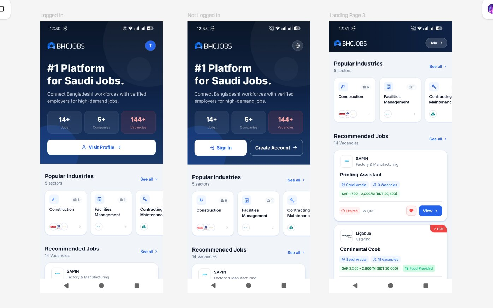

<div align="center">


# BHCJobs

**A React Native job portal for overseas job seekers — built with Expo Router**

[](https://github.com)
[](https://expo.dev/)
[](https://reactnative.dev/)
[](https://www.typescriptlang.org/)
[](LICENSE)

[Overview](#overview) · [Design](#design) · [Features](#features) · [Screens](#screens) · [Tech Stack](#tech-stack) · [API](#api-integration) · [Getting Started](#getting-started)

</div>

---

## Overview

BHCJobs is a mobile job portal that connects overseas job seekers with employers. It pulls live data from the BHCJobs API to display industries, companies, and job listings, and provides a full authentication flow — registration, login, and OTP phone verification. The app is built with TypeScript, Expo Router, and a clean component architecture across 13+ screens.

| Field      | Value                             |
| ---------- | --------------------------------- |
| Platform   | React Native / Expo               |
| Router     | Expo Router                       |
| Language   | TypeScript                        |
| Package ID | `com.foxbinner.bhcjobs`           |
| API Origin | `https://dev.bhcjobs.com`         |
| Storage    | `https://api.bhcjobs.com/storage` |
| License    | MIT                               |

---

## Design

Inspired by [bhcjobs.com](https://bhcjobs.com/) — dark hero, brand blue, and a clean card-based layout throughout.

**Click to see all pages:**  
[View on Figma →](https://www.figma.com/design/ROjoteEJRItrx1XElu2uTd/BHCJobs-Pages)



---

## Features

- **Dynamic landing page** — hero banner, popular industries, recommended jobs, and top companies from live APIs
- **Full auth flow** — registration with passport/DOB/gender fields, phone OTP verification, login, and forgot password
- **Token-based session** — Bearer token stored with AsyncStorage, auto-attached via Axios interceptor
- **Job shortlisting** — save and remove jobs, synced with the API and reflected in the Saved Jobs screen
- **Deep browsing** — dedicated detail screens for jobs, companies, and industries
- **Profile screen** — user account info fetched from the API
- **Reusable component library** — cards, banners, and shared UI elements used across all screens
- **Polished UI** — Inter font, linear gradients, expo-blur, safe-area support, and edge-to-edge Android layout

---

## Screens

| Screen           | Description                                               |
| ---------------- | --------------------------------------------------------- |
| Splash           | Branded splash with auth-aware navigation routing         |
| Landing          | Hero, popular industries, recommended jobs, top companies |
| Login            | Phone + password with validation                          |
| Registration     | Name, email, phone, password, passport, DOB, gender       |
| OTP Verification | Phone confirmation after registration                     |
| Jobs List        | Browse all job listings                                   |
| Job Details      | Full job info, salary, and shortlist action               |
| Saved Jobs       | User's shortlisted jobs                                   |
| Companies List   | Browse all employers                                      |
| Company Details  | Company profile and open roles                            |
| Industries List  | Category-based industry directory                         |
| Industry Details | Industry overview and related jobs                        |
| Profile          | User account details                                      |

---

## Tech Stack

| Category   | Library / Tool                                      |
| ---------- | --------------------------------------------------- |
| Framework  | React Native 0.81, Expo 54                          |
| Routing    | Expo Router 6                                       |
| Language   | TypeScript 5.9                                      |
| HTTP       | Axios                                               |
| Storage    | AsyncStorage                                        |
| UI / Icons | @expo/vector-icons, expo-linear-gradient, expo-blur |
| Fonts      | Inter (via @expo-google-fonts/inter)                |
| Build      | EAS Build                                           |

---

## API Integration

**Base URL:** `https://dev.bhcjobs.com`  
**Storage URL:** `https://api.bhcjobs.com/storage`

All requests are made via an Axios instance that automatically attaches an `Authorization: Bearer <token>` header from AsyncStorage when a session is active.

| Method | Endpoint                          | Description                 |
| ------ | --------------------------------- | --------------------------- |
| GET    | `/api/industry/get`               | Fetch all industries        |
| GET    | `/api/job/get`                    | Fetch all job listings      |
| GET    | `/api/job/get/:id`                | Fetch a single job          |
| GET    | `/api/company/get`                | Fetch all companies         |
| GET    | `/api/job_seeker/get`             | Fetch authenticated profile |
| POST   | `/api/job/shortlist`              | Shortlist a job             |
| POST   | `/api/job/shortlist/remove`       | Remove a shortlisted job    |
| POST   | `/api/job_seeker/register`        | Register a new account      |
| POST   | `/api/job_seeker/phone_verify`    | Verify phone with OTP       |
| POST   | `/api/job_seeker/login`           | Authenticate and get token  |
| POST   | `/api/job_seeker/forgot_password` | Initiate password reset     |

---

## Project Structure

```
bhcjobs-app/
├── app/              # File-based routes and screens (Expo Router)
├── components/       # Reusable UI components (cards, banners, etc.)
├── constants/
│   ├── colors.ts     # Brand and UI color tokens
│   ├── endpoints.ts  # API origin and storage base URLs
│   └── app.ts        # Shared app-wide constants
├── contexts/
│   └── AuthContext.tsx  # Auth state — user, signIn, signOut, refreshUser
├── services/
│   └── api.ts        # Axios instance and all API call functions
└── assets/           # Images, icons, splash, and screenshot
```

---

## Getting Started

### Prerequisites

- Node.js 18+
- [Expo Go](https://expo.dev/client) on your phone, or an Android/iOS simulator

### Installation

```bash
# Clone the repository
git clone <repo-url>
cd bhcjobs-app

# Install dependencies
npm install

# Start the development server
npm start
```

Scan the QR code in your terminal with Expo Go, or press `a` to open the Android emulator.

### APK

A pre-built APK is available under [**Releases**](../../releases) — download and install directly on any Android device.

### Environment Variables _(optional)_

The app works out of the box with the default API URLs. To override them, create a `.env` file in the project root:

```env
EXPO_PUBLIC_API_ORIGIN=https://dev.bhcjobs.com
EXPO_PUBLIC_STORAGE_BASE_ORIGIN=https://api.bhcjobs.com/storage
```

---

## License

This project is licensed under the [MIT License](LICENSE) — © 2026 LittleFox.
